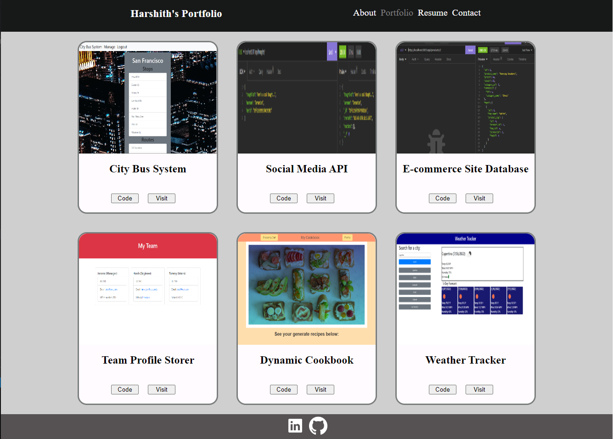

# Portfolio (React)

## Description
My updated portfolio curated on a single web page. Contains a brief segment about me, history of my pertinent education, and links to previous projects. Made using HTML and CSS, this project is a benchmark of my current abilities with these two skills. I made use of semantic elements, flex-boxes, and media queries to make a site that is also responsive to screen size.

## Deployed Site

## Deployed Site Link
[Portfolio Website](https://hmanjun.github.io/portfolio-react/)

## License
[Link](https://github.com/hmanjun/horiseon-refactor/blob/main/LICENSE)